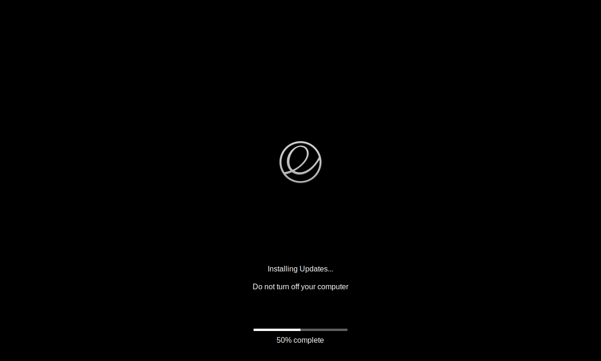

# Mac-like Plymouth boot theme

Plymouth theme that resembles the macOS boot screen, with a black background,
logo in the middle and progress bar near the bottom of the screen.

## Screenshots

Regular boot screen (showing Elementary OS logo from [BsxDarkFenceLight1](https://github.com/blackosx/BsxDarkFenceLight1)):


Boot screen during updates:



## How to use

- Clone this repo
- Copy the `mac-like` directory to `/usr/share/plymouth/themes`
- Update `header-image.png` with the logo you want to show during boot. See "Icons" below for more details.
- Register the new theme:
  ```
  sudo update-alternatives --install /usr/share/plymouth/themes/default.plymouth default.plymouth /usr/share/plymouth/themes/mac-like/mac-like.plymouth 100
  ```
- Choose the new theme as default (choose the appropriate number in the list that appears):
  ```
  sudo update-alternatives --config default.plymouth
  ```
- Regenerate initramfs:
  ```
  sudo update-initramfs -u
  ```
- Reboot and enjoy!

# Credits

- Sample icons from  [BsxDarkFenceLight1](https://github.com/blackosx/BsxDarkFenceLight1).
- Initial inspiration from https://github.com/fathyar/mac-plymouth.

